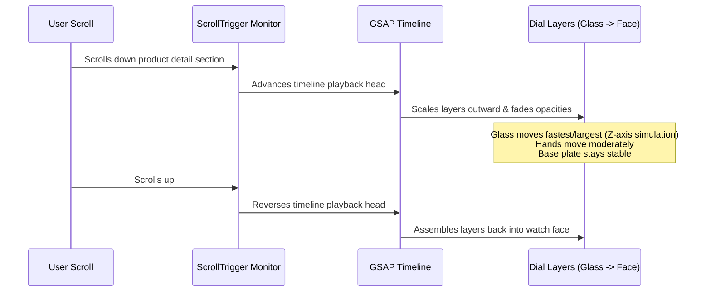

# Animation & Interaction Guide

This document establishes the interaction philosophy, performance boundaries, and implementation patterns for GSAP and Framer Motion inside the Levora platform.

---

## 1. Interaction Philosophy

Animations in a luxury brand experience must feel **deliberate, fluid, and weighted**. 
* **Avoid**: Rapid, jarring bounces, blinking indicators, and over-animated page elements.
* **Prioritize**: Smooth, ease-in-out transitions, deceleration curves that simulate physical inertia, and subtle scroll-linked element reveals.

---

## 2. GSAP (GreenSock) Guidelines

GSAP is reserved for complex timelines, scroll-driven coordinate shifts, and high-frequency animations.

### Scroll-Driven Exploded Dial Breakdown
The signature animation breakdown of the watch layers uses GSAP `ScrollTrigger`.



#### Code Pattern (Abstracted Reference)
To prevent memory leaks and ensure compatibility with React Server Components, client wrappers must manage GSAP registrations and cleanups:

```typescript
import { useEffect, useRef } from 'react';
import { gsap } from 'gsap';
import { ScrollTrigger } from 'gsap/ScrollTrigger';

gsap.registerPlugin(ScrollTrigger);

// Timeline initialization must run inside a cleanup hook
const containerRef = useRef<HTMLDivElement>(null);

useEffect(() => {
  const ctx = gsap.context(() => {
    const tl = gsap.timeline({
      scrollTrigger: {
        trigger: containerRef.current,
        start: 'top top',
        end: '+=150%',
        pin: true,
        scrub: 1, // Smooth scrub parameter simulates physical friction
      }
    });

    // Animate layers based on dynamic depths from the database
    layers.forEach((layer) => {
      tl.to(layer.ref, {
        scale: 1 + (layer.depth * 0.4),
        opacity: 1 - (layer.depth * 0.15),
        y: -layer.depth * 60, // Simulate vertical separation distance
        ease: 'none'
      }, 0);
    });
  }, containerRef);

  return () => ctx.revert(); // Automatically cleans up ScrollTriggers
}, [layers]);
```

### Extensible Storytelling Timelines
* **Pattern**: Story panels fade in sequentially while pining the background media (image/video).
* **Asset Independence**: Timelines dynamically query children selectors (e.g., `[data-story-step]`), making it easy to change text or append assets in Firestore without updating GSAP timeline code.

---

## 3. Framer Motion Guidelines

Framer Motion is used for layout-level page changes, modal entries, navigation drop-downs, and micro-hover states.

### Micro-Interactions
* **Card Hovers**: Scale up slightly, apply a soft lighting gloss transition:
  ```typescript
  const hoverAnimation = {
    hover: {
      y: -6,
      borderColor: "rgba(212, 175, 55, 0.3)", // Fade border to brand gold
      transition: { duration: 0.6, ease: [0.16, 1, 0.3, 1] } // Custom luxury cubic-bezier ease
    }
  };
  ```
* **Page Transitions**: Simple fade-and-slide layouts inside Next.js `layout.tsx` wrapper segments to keep routes unified.

### Shared Layout Animations (e.g., Wishlist Flyout)
* Use Framer Motion's `layoutId` attribute to smoothly animate visual assets from a product listing card directly into the wishlist panel or shopping cart drawer.

---

## 4. Performance Optimizations

High-fidelity animations can degrade page performance if not configured carefully. The following standards must be followed during implementation:

### 1. Hardware Acceleration
* **CSS Properties**: Only animate `transform` (scale, translate) and `opacity`. Avoid animating layout-triggering properties such as `width`, `height`, `top`, or `left`, which cause browser reflows.
* **will-change**: Apply `will-change: transform, opacity` to watch layers dynamically during ScrollTrigger execution to force GPU rasterization.

### 2. Layout Shift Control (CLS)
* Reserve explicit width and height spaces for watch images and dynamic viewers.
* When loading 3D canvases, render a static placeholder image inside an absolute container. Once the WebGL model compiles and becomes active, fade the placeholder out to ensure a seamless transition.

### 3. Scroll Listener Throttling
* Let GSAP manage scroll listening natively.
* Never bind high-frequency, vanilla JS scroll listeners (`window.addEventListener('scroll', ...)`) directly inside React components.
