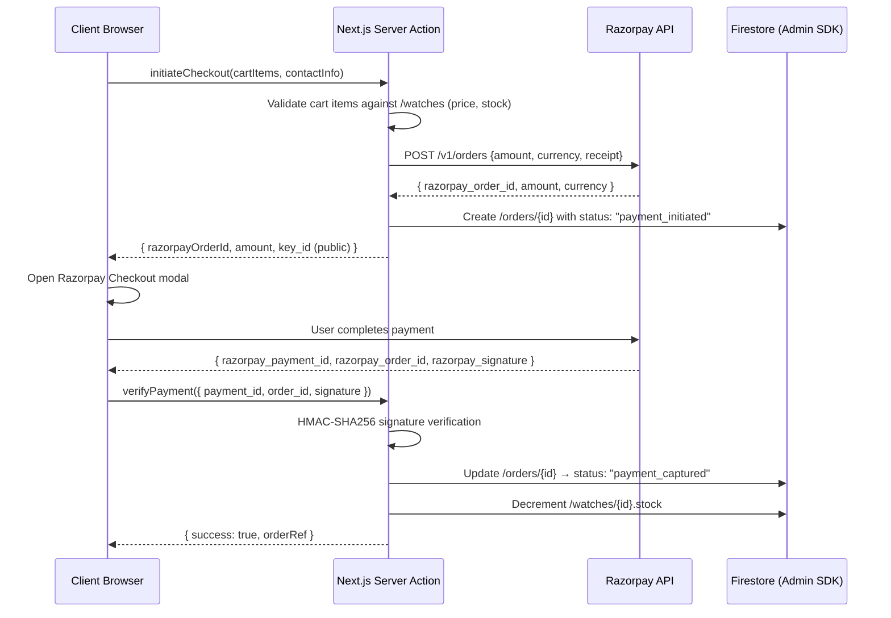
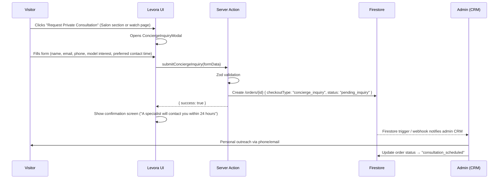
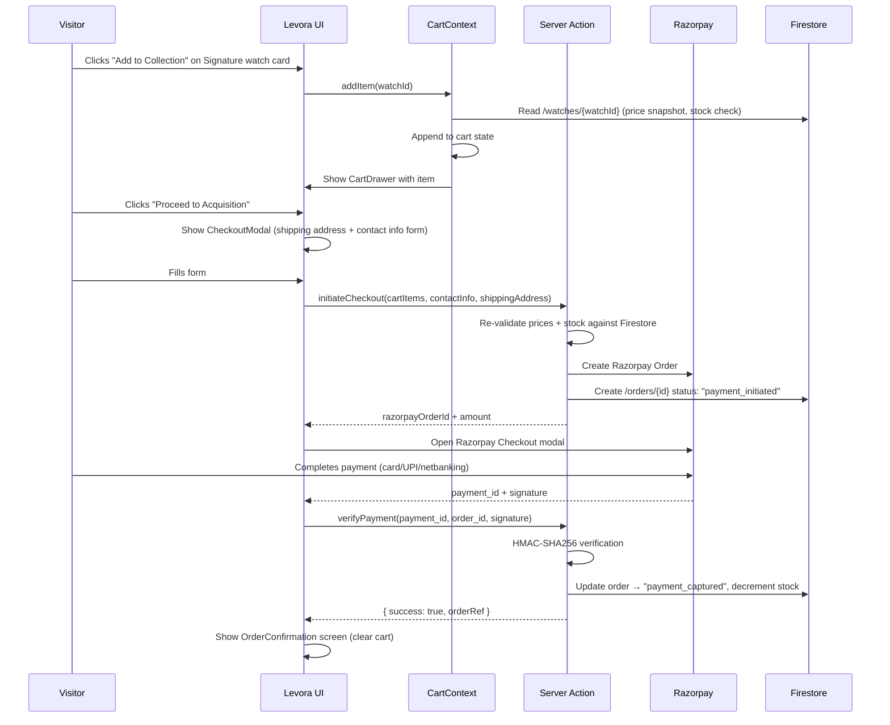

# Architecture Amendment 001 — Dual-Tier Product System

**Amendment ID**: ARCH-AMD-001  
**Status**: Approved for Sprint 3  
**Author**: Architecture Review  
**Date**: 2026-06-08  
**Supersedes**: DATABASE_SCHEMA.md §2, §5 · COLLECTIONS.md §1–3 · FIREBASE_ARCHITECTURE.md §3 · HOMEPAGE_ARCHITECTURE.md §5 (partial)

---

## Executive Summary

Levora will expand from a single ultra-luxury concierge model to a dual-tier product system:

| Tier | Collection | Purchase Mode | Audience |
|:---|:---|:---|:---|
| **Tier 1** | Heritage Collection | Concierge inquiry → private consultation | Ultra-HNI, collectors |
| **Tier 2** | Signature Collection | Direct online checkout via Razorpay | Affluent buyers |

This amendment defines every schema, flow, architecture change, and migration impact required to support both tiers simultaneously without diverging the core brand experience.

---

## 1. Collection Hierarchy Update

### 1.1 Current State

`COLLECTIONS.md` defines a single flat collection:

```
Heritage Collection
└── HERITAGE_01 … HERITAGE_07   (all concierge / inquiry-only)
```

The `/collections/{collectionId}` Firestore document has no purchase-tier discriminator beyond the per-watch `checkoutType` field.

### 1.2 Amended Hierarchy

Two first-class collections exist at the product-tier level. The `collections` Firestore document gains a `purchaseTier` field to govern routing, UI rendering, and server action behaviour.

```
Levora Product Catalog
├── Heritage Collection          (purchaseTier: "concierge")
│   ├── HERITAGE_01
│   ├── HERITAGE_02
│   ├── HERITAGE_03
│   ├── HERITAGE_04
│   ├── HERITAGE_05
│   ├── HERITAGE_06
│   └── HERITAGE_07
│
└── Signature Collection         (purchaseTier: "direct")
    ├── SIGNATURE_01
    ├── SIGNATURE_02
    └── … (expandable, no fixed count)
```

### 1.3 `collections` Document — Field Additions

Add to `/collections/{collectionId}`:

| Field | Type | Values | Purpose |
|:---|:---|:---|:---|
| `purchaseTier` | string | `"concierge"` \| `"direct"` | Governs checkout routing for every watch in this collection |
| `maxInventory` | number \| null | Integer or null | null = open-ended (Signature); fixed integer = limited edition (Heritage) |
| `isPubliclyListed` | boolean | — | false = invite-only or hidden from collection listing page |
| `launchDate` | timestamp \| null | — | For countdown / pre-launch state |

### 1.4 Watch `checkoutType` Semantics

The existing per-watch `checkoutType` field is **retained and becomes the authoritative discriminator**. The collection-level `purchaseTier` is a default that pre-fills `checkoutType` on new watch documents but can be overridden per item.

| `checkoutType` value | Meaning | Purchase Flow |
|:---|:---|:---|
| `"concierge_inquiry"` | Heritage — no direct cart | Concierge inquiry modal → admin contacts buyer |
| `"direct_checkout"` | Signature — Razorpay enabled | Cart → Razorpay payment → order fulfillment |

---

## 2. Cart Architecture

### 2.1 Design Rationale

Cart is **Signature Collection only**. Heritage watches never enter a cart. The cart must be:
- **Session-persistent**: Survives page refresh (localStorage + Firestore sync for logged-in users).
- **Server-authoritative on checkout**: Price and stock are re-validated server-side at order creation. Client-side cart state is display-only.
- **Guest-capable**: Razorpay checkout does not require Firebase auth.

### 2.2 Cart State Machine

```
EMPTY ──add item──► ACTIVE ──remove last item──► EMPTY
                      │
                      │ initiate checkout
                      ▼
                  CHECKOUT_PENDING
                      │
                      │ Razorpay opens / server validates
                      ▼
                  PAYMENT_IN_PROGRESS
                      │
              ┌───────┴───────┐
              │               │
           success          failure
              │               │
              ▼               ▼
          COMPLETED        ACTIVE (cart restored, error shown)
```

### 2.3 New Firestore Collection — `carts`

**Path**: `/carts/{cartId}`

> `cartId` = Firebase Auth `uid` for logged-in users; session UUID (stored in localStorage) for guests.

| Field | Type | Description |
|:---|:---|:---|
| `cartId` | string | Matches uid or session UUID |
| `userId` | string \| null | Firebase uid if authenticated; null for guests |
| `sessionId` | string | Always set; equals uid for authenticated users |
| `items` | array of `CartItem` | Line items (see §2.4) |
| `subtotal` | number | Computed sum in minor units (INR paise) |
| `currency` | string | `"INR"` (ISO 4217) |
| `createdAt` | timestamp | — |
| `updatedAt` | timestamp | — |
| `expiresAt` | timestamp | TTL: 7 days from last update. Cloud Function prunes stale carts. |

### 2.4 `CartItem` Shape (embedded array)

| Field | Type | Description |
|:---|:---|:---|
| `watchId` | string | Reference to `/watches/{watchId}` |
| `collectionId` | string | Denormalized for display (avoids extra read) |
| `name` | string | Denormalized watch name snapshot |
| `slug` | string | Denormalized for routing |
| `priceSnapshot` | number | Price at time of add (minor units). Server re-validates at checkout. |
| `quantity` | number | Always 1 for luxury; schema supports >1 for future use |
| `thumbnailUrl` | string | Static render URL for cart UI |
| `addedAt` | timestamp | — |

### 2.5 Cart Context — Client Architecture

```
context/CartContext.tsx            ← React Context + Provider ("use client")
│
├── State
│   ├── items: CartItem[]
│   ├── subtotal: number
│   └── status: "idle" | "syncing" | "error"
│
├── Actions
│   ├── addItem(watchId)           → reads /watches/{watchId}, appends to items
│   ├── removeItem(watchId)        → splices from items array
│   ├── clearCart()                → empties items
│   └── syncToFirestore()          → debounced write to /carts/{cartId}
│
└── Persistence
    ├── localStorage: "levora_cart" key (immediate, always)
    └── Firestore /carts/{cartId}: synced on change (logged-in users only)
```

### 2.6 Cart UI Components (New)

| Component | Path | Purpose |
|:---|:---|:---|
| `CartDrawer` | `components/ui/CartDrawer.tsx` | Slide-in panel from right; shows items, subtotal, checkout CTA |
| `CartItem` | `components/ui/CartItem.tsx` | Single line item row within drawer |
| `CartIcon` | `components/ui/CartIcon.tsx` | Header badge with item count |
| `MiniCart` | `components/ui/MiniCart.tsx` | Dropdown summary on hover (desktop) |

### 2.7 Firestore Security Rules — `carts`

```javascript
match /carts/{cartId} {
  // Authenticated user owns their cart (uid == cartId)
  allow read, write: if isSignedIn() && request.auth.uid == cartId;
  // Guest carts are written server-side only via Admin SDK
  allow read: if false; // guests read from localStorage, not Firestore
}
```

---

## 3. Order Architecture

### 3.1 Current State

The existing `/orders/{orderId}` schema serves both concierge and direct in one polymorphic document using `checkoutType` as discriminator.

### 3.2 Amended Order Schema

The schema is extended. All existing fields are preserved. **Bold rows are new.**

**Path**: `/orders/{orderId}`

| Field | Type | Values | Notes |
|:---|:---|:---|:---|
| `id` | string | — | Auto-generated Firestore doc ID |
| `orderRef` | string | `"LVR-YYYY-XXXXXX"` | **NEW** Human-readable reference number |
| `userId` | string \| null | Firebase uid | null = guest |
| `checkoutType` | string | `"concierge_inquiry"` \| `"direct_checkout"` | Existing |
| `tier` | string | `"heritage"` \| `"signature"` | **NEW** Collection tier at time of order |
| `contactInfo` | map | name, email, phone | Existing |
| `shippingAddress` | map \| null | — | Existing; null for concierge (shipping arranged post-consultation) |
| `items` | array of `OrderItem` | — | Existing (see §3.3) |
| `subtotal` | number | Minor units | **NEW** Pre-tax total |
| `tax` | number | Minor units | **NEW** GST amount |
| `total` | number | Minor units | Existing; now explicitly = subtotal + tax |
| `currency` | string | `"INR"` | — |
| `status` | string | See §3.4 | Existing + extended |
| `paymentInfo` | map \| null | See §4 | Existing; null for concierge |
| `conciergeInfo` | map \| null | See §5.3 | **NEW** null for direct checkout |
| `notes` | string \| null | Customer note at checkout | **NEW** |
| `adminNotes` | string \| null | Internal admin notes | **NEW** |
| `createdAt` | timestamp | — | Existing |
| `updatedAt` | timestamp | — | Existing |

### 3.3 `OrderItem` Shape (amended)

| Field | Type | Notes |
|:---|:---|:---|
| `watchId` | string | — |
| `collectionId` | string | **NEW** Denormalized |
| `name` | string | **NEW** Snapshot at order time |
| `priceAtPurchase` | number | Existing |
| `quantity` | number | Existing |
| `thumbnailUrl` | string | **NEW** Snapshot for receipts / admin |

### 3.4 Order Status State Machine

Two parallel status tracks merge into shared terminal states:

```
Concierge Track
────────────────
pending_inquiry  ──► inquiry_reviewed  ──► consultation_scheduled
                                                    │
                                         ┌──────────┴───────────┐
                                      sale_agreed           declined
                                         │
                                    awaiting_payment ──► paid ──► shipped ──► delivered

Direct Checkout Track
─────────────────────
cart_checkout  ──► payment_initiated  ──► payment_failed (→ back to cart)
                         │
                    payment_captured ──► processing ──► shipped ──► delivered

Shared Terminal States
──────────────────────
cancelled   (either track, pre-shipment)
refunded    (post-payment, either track)
archived    (admin archival, replaces delete)
```

**Allowed `status` values** (complete enumeration):

`pending_inquiry` · `inquiry_reviewed` · `consultation_scheduled` · `sale_agreed` · `declined` · `cart_checkout` · `payment_initiated` · `payment_failed` · `payment_captured` · `awaiting_payment` · `paid` · `processing` · `shipped` · `delivered` · `cancelled` · `refunded` · `archived`

---

## 4. Payment Architecture (Razorpay — Signature Only)

### 4.1 Integration Model

Razorpay operates **server-side first**. The client never handles sensitive payment keys. The flow uses Razorpay Orders API to create a server-side order before the Razorpay checkout modal opens on the client.



### 4.2 `paymentInfo` Map — Full Schema

Added to `/orders/{orderId}.paymentInfo` (null for concierge orders):

| Field | Type | Description |
|:---|:---|:---|
| `gateway` | string | `"razorpay"` |
| `razorpayOrderId` | string | ID from Razorpay Orders API |
| `razorpayPaymentId` | string \| null | Set after capture |
| `razorpaySignature` | string \| null | HMAC for server-side verification |
| `status` | string | `"initiated"` \| `"captured"` \| `"failed"` \| `"refunded"` |
| `capturedAt` | timestamp \| null | — |
| `failureReason` | string \| null | Razorpay error message on failure |
| `method` | string \| null | `"card"` \| `"upi"` \| `"netbanking"` \| `"wallet"` |
| `bank` | string \| null | Bank name if applicable |
| `refundId` | string \| null | Razorpay refund ID if refunded |
| `refundedAt` | timestamp \| null | — |
| `refundAmount` | number \| null | Minor units |

### 4.3 Environment Variables — New (Razorpay)

```bash
# Server-only (never expose to client)
RAZORPAY_KEY_ID="rzp_live_..."
RAZORPAY_KEY_SECRET="..."

# Public (safe for Razorpay checkout modal init)
NEXT_PUBLIC_RAZORPAY_KEY_ID="rzp_live_..."
```

### 4.4 Server Action — `app/actions/payment.ts`

Three new server actions (no implementation here — schema only):

| Action | Input | Output | Side Effect |
|:---|:---|:---|:---|
| `initiateCheckout` | `cartItems[]`, `contactInfo`, `shippingAddress` | `razorpayOrderId`, `amount` | Creates `/orders` doc, status → `payment_initiated` |
| `verifyPayment` | `razorpayPaymentId`, `razorpayOrderId`, `razorpaySignature` | `{ success, orderRef }` | Verifies HMAC; updates order status → `payment_captured`; decrements stock |
| `initiateRefund` | `orderId`, `amount?` | `{ refundId }` | Admin-only; calls Razorpay Refunds API; updates order |

### 4.5 Idempotency

- Each Razorpay Order creation uses the Firestore order doc ID as the `receipt` field.
- `verifyPayment` is idempotent: if `payment_captured` is already set, return success without re-processing.
- Stock decrement uses a Firestore transaction to prevent race conditions.

---

## 5. Concierge Flow — Heritage Collection

### 5.1 Design Principle

Heritage buyers do not transact — they are invited. The concierge flow is a **qualified-lead capture system**, not a checkout system.

### 5.2 Concierge Flow Sequence



### 5.3 `conciergeInfo` Map — Full Schema

Added to `/orders/{orderId}.conciergeInfo` (null for direct checkout orders):

| Field | Type | Description |
|:---|:---|:---|
| `interestedWatchIds` | string[] | Watch IDs the buyer expressed interest in |
| `preferredContactTime` | string \| null | Free-text (e.g., "Weekday afternoons") |
| `preferredContactMethod` | string | `"phone"` \| `"email"` \| `"whatsapp"` |
| `budget` | string \| null | Optional range (e.g., `"₹5L–₹10L"`) |
| `message` | string \| null | Free-text buyer note |
| `assignedSpecialistId` | string \| null | Admin `uid` of assigned Levora specialist |
| `consultationDate` | timestamp \| null | Scheduled consultation time |
| `consultationNotes` | string \| null | Specialist internal notes post-call |
| `followUpDue` | timestamp \| null | Reminder timestamp for admin |

### 5.4 Server Action — `app/actions/concierge.ts`

| Action | Input | Output | Side Effect |
|:---|:---|:---|:---|
| `submitConciergeInquiry` | `ConciergeInquiryFormData` | `{ success, inquiryRef }` | Creates `/orders` doc with `checkoutType: "concierge_inquiry"` |
| `updateConciergeStatus` | `orderId`, `status`, `conciergeInfo` patch | `{ success }` | Admin-only; updates status + specialist notes |

### 5.5 Inquiry Form Fields (`ConciergeInquiryFormData`)

```typescript
// types/inquiry.ts — Amendment
interface ConciergeInquiryFormData {
  name: string;               // required
  email: string;              // required, validated
  phone: string;              // required, E.164 format
  interestedWatchIds: string[]; // required, min 1
  preferredContactMethod: "phone" | "email" | "whatsapp";
  preferredContactTime?: string;
  budget?: string;
  message?: string;
}
```

---

## 6. Direct Checkout Flow — Signature Collection

### 6.1 Design Principle

The Signature checkout must feel premium, not transactional. It is not a conventional e-commerce funnel — it is a **guided acquisition experience** that happens to accept payment.

### 6.2 Direct Checkout Flow Sequence



### 6.3 Checkout UI Components (New)

| Component | Path | Purpose |
|:---|:---|:---|
| `CheckoutModal` | `components/ui/CheckoutModal.tsx` | Full-screen overlay: shipping form + order summary |
| `OrderSummary` | `components/ui/OrderSummary.tsx` | Line items + subtotal + tax breakdown |
| `OrderConfirmation` | `components/ui/OrderConfirmation.tsx` | Post-payment success screen with `orderRef` |
| `PaymentButton` | `components/ui/PaymentButton.tsx` | Razorpay trigger button with loading state |

### 6.4 Guest vs Authenticated Checkout

| Scenario | Cart Persistence | Order `userId` | Post-Order |
|:---|:---|:---|:---|
| Guest | localStorage only | null | Email confirmation only |
| Logged-in | localStorage + Firestore `/carts/{uid}` | Firebase uid | Order appears in account dashboard |

---

## 7. Homepage Changes Required

### 7.1 Section 05 — The Collection (Amended)

Currently shows all 7 Heritage watches in a single draggable slider with a generic "Explore" CTA.

**Required changes:**

- **Collection Toggle**: Add a tab/toggle control at the top of Section 05 to switch between *Heritage Collection* and *Signature Collection* sliders.
- **Per-Card CTA Logic**: CTA button on each watch card must branch on `checkoutType`:
  - `checkoutType === "concierge_inquiry"` → button label: *"Request Private Consultation"* → triggers `ConciergeInquiryModal`
  - `checkoutType === "direct_checkout"` → button label: *"Add to Collection"* → calls `CartContext.addItem()`
- **Cart Icon in Header**: `components/layout/Header.tsx` gains `CartIcon` component (visible only when Signature items are in the cart).

**Component tree amendment for Section 05:**

```txt
<section id="collection">
  ├── [CollectionToggle]                       ← NEW: "Heritage" | "Signature" tab
  │
  ├── [Heritage Slider] (conditional)
  │   └── WatchContainer × 7
  │       └── StaticRenderer
  │           └── WatchMeta
  │               └── Button → ConciergeInquiryModal  ← existing flow
  │
  └── [Signature Slider] (conditional)         ← NEW
      └── WatchContainer × N
          └── StaticRenderer
              └── WatchMeta
                  └── Button → CartContext.addItem()  ← NEW flow
```

### 7.2 Section 06 — The Private Salon (Unchanged)

The Salon section remains Heritage-only. Copy and CTA are unchanged. No modifications required.

### 7.3 Header Amendment

| Element | Change |
|:---|:---|
| `CartIcon` | **NEW** — appears right of primary nav; shows badge count from `CartContext` |
| Nav link: "Collections" | Dropdown now lists both Heritage Collection and Signature Collection |

### 7.4 New Page Routes Required

| Route | Purpose |
|:---|:---|
| `/collections/signature` | Signature Collection listing page |
| `/collections/signature/[slug]` | Individual Signature watch detail page |
| `/cart` | Full cart page (fallback for small screens if drawer is too compact) |
| `/checkout` | Dedicated checkout page (alternative to modal, for SEO + direct linking) |
| `/orders/[orderRef]` | Order confirmation + status tracking page |
| `/account/orders` | Authenticated user's order history |

---

## 8. Firestore Changes Required

### 8.1 Existing Collection — Schema Additions

#### `/collections/{collectionId}` — New Fields

```
+ purchaseTier       : "concierge" | "direct"
+ maxInventory       : number | null
+ isPubliclyListed   : boolean
+ launchDate         : timestamp | null
```

#### `/watches/{watchId}` — No Field Changes

`checkoutType` already exists and covers both tiers. No new fields needed at the watch level.

#### `/orders/{orderId}` — New Fields

```
+ orderRef           : string          (e.g. "LVR-2026-001847")
+ tier               : "heritage" | "signature"
+ subtotal           : number          (minor units)
+ tax                : number          (minor units)
+ conciergeInfo      : ConciergeInfo | null
+ notes              : string | null
+ adminNotes         : string | null
```

Extended `status` enum (see §3.4 for full list).

### 8.2 New Firestore Collections

#### `/carts/{cartId}`
Full schema defined in §2.3.

#### `/inquiries/{inquiryId}` — Optional Dedicated Collection

> **Decision point**: Concierge inquiries can live in `/orders` (current plan) or in a dedicated `/inquiries` collection.
>
> **Recommendation**: Keep concierge inquiries in `/orders` with `checkoutType: "concierge_inquiry"`. This avoids splitting the admin's order-management dashboard across two collections and allows unified reporting.

### 8.3 Cloud Functions Required (New)

| Function | Trigger | Purpose |
|:---|:---|:---|
| `pruneExpiredCarts` | Pub/Sub schedule (daily) | Deletes `/carts` documents where `expiresAt < now()` |
| `onOrderCreated` | Firestore onCreate `/orders/{id}` | Sends email confirmation (concierge: inquiry received; direct: order confirmed) |
| `onPaymentCaptured` | Firestore onUpdate `/orders/{id}` (status change) | Triggers fulfilment workflow, notifies warehouse |
| `generateOrderRef` | Firestore onCreate `/orders/{id}` | Generates sequential human-readable `orderRef` (`LVR-YYYY-XXXXXX`) |

### 8.4 Firestore Security Rules — Full Amendment

```javascript
rules_version = '2';
service cloud.firestore {
  match /databases/{database}/documents {

    function isSignedIn() {
      return request.auth != null;
    }
    function isOwner(userId) {
      return isSignedIn() && request.auth.uid == userId;
    }
    function isAdmin() {
      return isSignedIn() &&
        get(/databases/$(database)/documents/users/$(request.auth.uid)).data.role == 'admin';
    }

    // Unchanged: Collections, Watches, Stories — public read
    match /collections/{collectionId} {
      allow read: if true;
      allow write: if isAdmin();
    }
    match /watches/{watchId} {
      allow read: if true;
      allow write: if isAdmin();
    }
    match /stories/{storyId} {
      allow read: if true;
      allow write: if isAdmin();
    }

    // Unchanged: User profiles + wishlists
    match /users/{userId} {
      allow read, update: if isOwner(userId) || isAdmin();
      allow create: if isSignedIn();
      allow delete: if isAdmin();
      match /wishlists/{watchId} {
        allow read, write: if isOwner(userId);
      }
    }

    // Unchanged: Orders — guest create allowed (concierge inquiry)
    match /orders/{orderId} {
      allow create: if true;
      allow read: if isAdmin() || (isSignedIn() && resource.data.userId == request.auth.uid);
      allow update: if isAdmin();
      allow delete: if false;
    }

    // NEW: Carts — authenticated user owns their cart only
    match /carts/{cartId} {
      allow read, write: if isSignedIn() && request.auth.uid == cartId;
      // Guest cart writes go through Admin SDK (Server Action) only
    }
  }
}
```

---

## 9. Migration Impact

### 9.1 Existing Data — Heritage Collection

No existing watch or collection documents require field removal or type changes.

| Document | Required Action | Breaking Change? |
|:---|:---|:---|
| `/collections/heritage` | **Add** `purchaseTier: "concierge"`, `maxInventory: 7`, `isPubliclyListed: true`, `launchDate: null` | No — additive only |
| `/watches/HERITAGE_01` … `HERITAGE_07` | No changes required — `checkoutType: "concierge_inquiry"` already present | No |
| `/orders/*` (existing) | **Add** `orderRef` (backfill script), `tier: "heritage"`, `subtotal` = `total`, `tax: 0`, `conciergeInfo` = null | No — Firestore ignores missing fields on read; admin dashboard needs update to handle null |

### 9.2 Existing Code — Impact Surface

| File | Change Required | Priority |
|:---|:---|:---|
| `types/collection.ts` | Add `purchaseTier`, `maxInventory`, `isPubliclyListed`, `launchDate` fields | Sprint 3 |
| `types/order.ts` | Add `orderRef`, `tier`, `subtotal`, `tax`, `conciergeInfo`, `notes`, `adminNotes`; extend `status` union | Sprint 3 |
| `types/inquiry.ts` | Add `ConciergeInquiryFormData` with new fields | Sprint 3 |
| `types/cart.ts` | **NEW FILE** — `Cart`, `CartItem` types | Sprint 3 |
| `types/payment.ts` | **NEW FILE** — `PaymentInfo`, `RazorpayCheckoutResponse` types | Sprint 3 |
| `app/actions.ts` | Split into `app/actions/concierge.ts` + `app/actions/payment.ts` | Sprint 3 |
| `context/CartContext.tsx` | **NEW FILE** — Cart state and sync logic | Sprint 3 |
| `components/layout/Header.tsx` | Add `CartIcon` component integration | Sprint 3 |
| `components/ui/Modal.tsx` | Extend to support `CheckoutModal` variant | Sprint 3 |
| `app/page.tsx` | Section 05: add `CollectionToggle`, conditional sliders, branched CTA logic | Sprint 3 |
| `lib/constants/collection.ts` | Add Signature Collection placeholder constants | Sprint 3 |
| `docs/COLLECTIONS.md` | Document Signature Collection lineup when finalized | Sprint 3 |
| `docs/DATABASE_SCHEMA.md` | Update schema tables to reflect all amendments in this document | Sprint 3 |

### 9.3 No-Impact Files (Explicitly Preserved)

The following files require **zero changes** as a result of this amendment:

- `lib/gsap/**` — All GSAP animation factories are display-layer only
- `app/layout.tsx` — Root layout unaffected
- `components/watch/LayeredRenderer.tsx` — Heritage-only, no purchase logic
- `components/story/StoryScroller.tsx` — Display only
- `app/typography.css`, `app/globals.css` — Design system unchanged
- `docs/ANIMATION_GUIDE.md`, `docs/DESIGN_SYSTEM.md` — No impact

### 9.4 Migration Script Needed (Pre-Sprint 3)

A one-time Firestore migration script is required before Sprint 3 implementation begins:

```
scripts/migrate-001-dual-tier.ts
```

**Tasks**:
1. Read all documents in `/collections`.
2. Add `purchaseTier: "concierge"`, `maxInventory`, `isPubliclyListed`, `launchDate: null` to the Heritage collection document.
3. Read all documents in `/orders`.
4. Backfill `tier: "heritage"`, `subtotal = total`, `tax: 0`, `conciergeInfo: null`, `notes: null`, `adminNotes: null`.
5. Backfill `orderRef` using format `LVR-${year}-${paddedIndex}`.
6. Dry-run mode (`--dry-run` flag) prints changes without writing.
7. Log all changes with document IDs for audit.

---

## Summary of All New/Changed Documents

| Document | Change Type | Summary |
|:---|:---|:---|
| `docs/COLLECTIONS.md` | **Amend** | Add Signature Collection to hierarchy |
| `docs/DATABASE_SCHEMA.md` | **Amend** | New `carts` collection; extended `orders`, `collections` fields |
| `docs/FIREBASE_ARCHITECTURE.md` | **Amend** | New server actions; Razorpay integration pattern; Cloud Functions |
| `docs/HOMEPAGE_ARCHITECTURE.md` | **Amend** | Section 05 toggle; Header cart icon; new routes |
| `docs/ARCHITECTURE_AMENDMENT_001.md` | **NEW** | This document |

---

*Amendment status: Approved for Sprint 3 planning.*  
*This document supersedes conflicting specifications in the documents listed above.*  
*All implementation must reference this amendment as authoritative until superseded by a subsequent amendment.*
