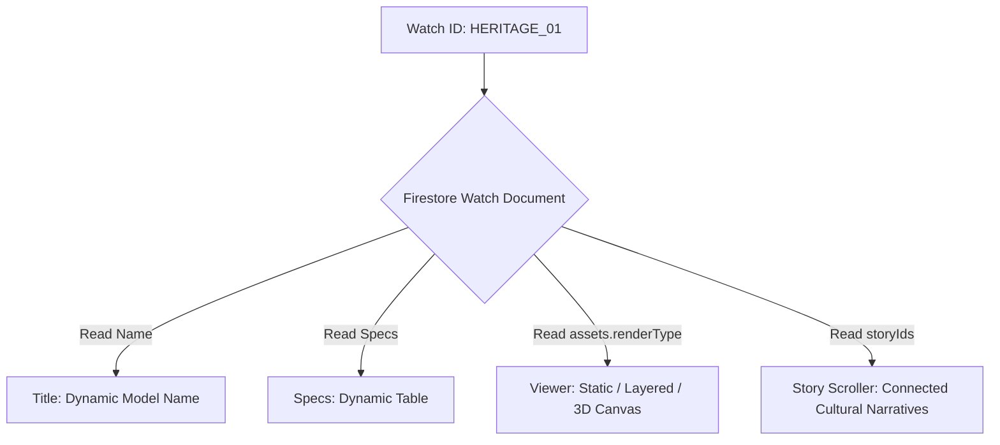

# Collections & Product Catalog

This document details the product lineup of the **Heritage Collection** (comprising 7 flagship watches, internally identified as `HERITAGE_01` through `HERITAGE_07`) and defines the data-driven database relationships. Watch names, detailed cultural stories, artwork, and specifications will be resolved dynamically from the database.

---

## 1. The Heritage Collection (Initial Lineup placeholders)

The initial collection is structured as 7 placeholder slots, allowing final names, descriptions, and assets to be loaded from Firestore without modifying client code.

| Model ID | Placeholder Label | Target Render Mode | Associated Story ID |
| :--- | :--- | :--- | :--- |
| **HERITAGE_01** | Heritage Model 01 | Layered Dial Composition | `story_heritage_01` |
| **HERITAGE_02** | Heritage Model 02 | Layered Dial Composition | `story_heritage_02` |
| **HERITAGE_03** | Heritage Model 03 | Layered Dial / Open-Heart | `story_heritage_03` |
| **HERITAGE_04** | Heritage Model 04 | Static Render / Gallery | `story_heritage_04` |
| **HERITAGE_05** | Heritage Model 05 | Static Render / Gallery | `story_heritage_05` |
| **HERITAGE_06** | Heritage Model 06 | Future 3D Model | `story_heritage_06` |
| **HERITAGE_07** | Heritage Model 07 | Future 3D Model / Static | `story_heritage_07` |

---

## 2. Dynamic Spec & Story Mapping Architecture

To support swapping watch identities later, the front-end application code contains no static mappings. Each watch model binds dynamically using its internal ID:

### 1. `HERITAGE_01`
* **Dynamic Binding**: Links to document `/watches/HERITAGE_01`.
* **Render Asset Schema**: Expected to contain a multi-layer array in Firestore representing dial assets (e.g., dial plate, hands, glass bezel overlay).
* **Narrative Reference**: Binds to `/stories/story_heritage_01`.

### 2. `HERITAGE_02`
* **Dynamic Binding**: Links to document `/watches/HERITAGE_02`.
* **Render Asset Schema**: Expected to contain a layered array representing dial assets.
* **Narrative Reference**: Binds to `/stories/story_heritage_02`.

### 3. `HERITAGE_03`
* **Dynamic Binding**: Links to document `/watches/HERITAGE_03`.
* **Render Asset Schema**: Configured for layered dial elements with transparency properties.
* **Narrative Reference**: Binds to `/stories/story_heritage_03`.

### 4. `HERITAGE_04`
* **Dynamic Binding**: Links to document `/watches/HERITAGE_04`.
* **Render Asset Schema**: Configured for high-resolution static product photography renders.
* **Narrative Reference**: Binds to `/stories/story_heritage_04`.

### 5. `HERITAGE_05`
* **Dynamic Binding**: Links to document `/watches/HERITAGE_05`.
* **Render Asset Schema**: Configured for static product gallery views.
* **Narrative Reference**: Binds to `/stories/story_heritage_05`.

### 6. `HERITAGE_06`
* **Dynamic Binding**: Links to document `/watches/HERITAGE_06`.
* **Render Asset Schema**: Configured with 3D model configuration fields (`model3dUrl`, `cameraPosition`).
* **Narrative Reference**: Binds to `/stories/story_heritage_06`.

### 7. `HERITAGE_07`
* **Dynamic Binding**: Links to document `/watches/HERITAGE_07`.
* **Render Asset Schema**: Configured with 3D model configuration fields.
* **Narrative Reference**: Binds to `/stories/story_heritage_07`.

---

## 3. Dynamic Multi-Collection Expansion Plan

The database layout allows you to launch entire new watch collections (e.g. *Royal Chronographs*) without rebuilding or updating client code:

1. **Add Collection**: Create a new document in `/collections` with a unique ID (e.g. `royal_chronographs`).
2. **Add Products**: Add new watch documents in `/watches` with `collectionId: "royal_chronographs"`.
3. **Automated Listing**: The collection layout route (`app/collections/page.tsx`) queries `/collections` dynamically and populates the listing cards, catalog, and routes on the fly.
