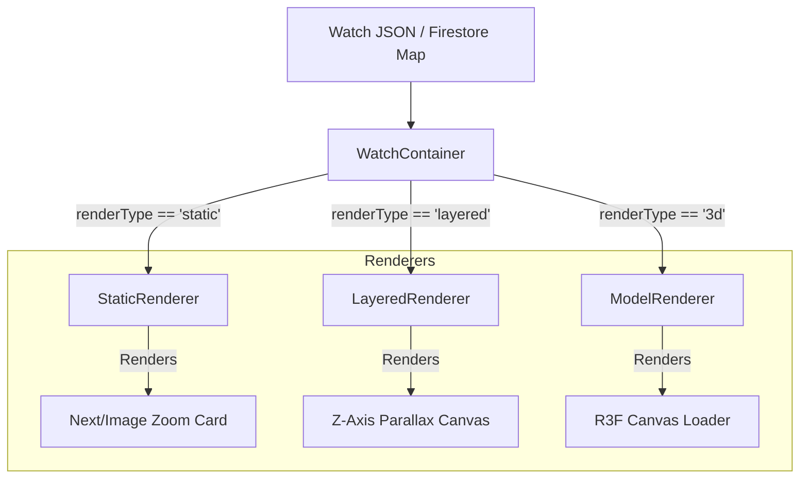

# Component Architecture Documentation

This document outlines the React component strategy for Levora, focusing on structure, modularity, dynamic renderers, and premium styling standards.

---

## Component Folder Layout

Components are stored in the `/components` folder under the root and organized by concern:

```txt
components/
├── layout/                  # Global framing layout items
│   ├── Header.tsx           # Glassmorphic, scroll-aware brand header
│   └── Footer.tsx           # Sophisticated column grid with newsletter
├── ui/                      # Base visual primitives (design tokens)
│   ├── Button.tsx           # Luxury action button (brushed metal, gold highlight)
│   ├── GlassCard.tsx        # High-blur glass containers with micro-borders
│   ├── Modal.tsx            # Animated overlay frames
│   └── Slider.tsx           # Smooth swiper controls
├── watch/                   # Specialized watch visualization elements
│   ├── WatchContainer.tsx   # Polymorphic entry selector component
│   ├── StaticRenderer.tsx   # High-resolution flat render layout
│   ├── LayeredRenderer.tsx  # Dynamic GSAP dial separation component
│   └── ModelRenderer.tsx    # React Three Fiber 3D model engine
└── story/                   # Heritage storytelling sections
    ├── StoryScroller.tsx    # GSAP scroll storytelling engine
    └── DynamicVideo.tsx     # Ambient streaming video loop helper
```

---

## 1. Global Layout Components

### `Header` Component
* **UX/UI Target**: A ultra-thin, floating glassmorphic header that stays out of the way of immersive visuals.
* **Behaviors**:
  * **Hide-on-Scroll**: Hides when scrolling down, slides back down into view when scrolling up (using GSAP or Framer Motion hook).
  * **Translucent Blur**: Uses Tailwind v4's backdrop filter properties to blur content passing behind it.
  * **Logo Transition**: The Levora logo shifts from a centered majestic crest to a clean minimal text logo on scroll.

### `Footer` Component
* **UX/UI Target**: A calm, dark-themed footer focusing on heritage values and concierge inquiries.
* **Behaviors**:
  * Grid showing collections, heritage stories, craftsmanship, and support.
  * Integration of a luxury newsletter sign-up using the Next.js 16 native `<Form>` component.

---

## 2. Polymorphic Asset Renderer (`WatchContainer`)

The `WatchContainer` acts as the orchestrator component. It reads the database record and maps the target `renderType` to the active viewer component.



### Static Renderer (`StaticRenderer.tsx`)
* **Purpose**: Serves as the primary loading fallback and standard catalog layout.
* **Design**: Uses Next.js `<Image>` with `sizes` optimizations, wrapped in a panning zoom grid. On mouse hover, the image scales slowly (`scale-105 duration-1000`) to create a floating motion.

### Layered Explosion Renderer (`LayeredRenderer.tsx`)
* **Purpose**: Deconstructs the "laser-cut layered dial construction" on scroll.
* **Implementation Details**:
  * Rendered inside a relative container.
  * Renders a series of absolute positioned layers ordered by database `zIndex` fields.
  * Triggers a GSAP `ScrollTrigger` animation sequence, moving each layer outward along the Z-axis (simulated by scale and opacity scaling) as the product details page is scrolled.
  * *Code Separation*: Asset paths are fed in as props. If assets are replaced in Firestore, this component updates automatically.

### 3D Watch Model Renderer (`ModelRenderer.tsx`)
* **Purpose**: Provides interactive orbital 3D watch inspection.
* **Implementation Details**:
  * **Lazy Loaded**: Imported dynamically (`next/dynamic`) to exclude Three.js and `@react-three/fiber` from the main bundle until selected:
    ```typescript
    const ModelRenderer = dynamic(() => import('./ModelRenderer'), {
      ssr: false,
      loading: () => <StaticRenderer {...fallbackProps} />
    });
    ```
  * **Environment**: Custom lighting maps simulating jewelry store conditions (soft overhead lights, gold reflector maps).
  * **Orbit Controls**: Allows mouse rotation and pinch-to-zoom within a bounded frame.

---

## 3. UI Primitives (`components/ui`)

### Luxury Action Button (`Button.tsx`)
* **Aesthetics**: Avoids standard bright color fill styles. Instead:
  * Brushed metallic background (`bg-gradient-to-r from-zinc-800 to-zinc-900`).
  * Thin metallic borders (`border-[0.5px] border-zinc-700/50`).
  * Subtle hover transition revealing a soft gold linear gradient overlay (`hover:border-amber-500/40 text-amber-100`).

### Glassmorphic Card (`GlassCard.tsx`)
* **Aesthetics**: Glass panels designed to feel premium.
  ```html
  <div className="bg-zinc-950/40 backdrop-blur-xl border border-white/5 shadow-2xl rounded-2xl">
     <!-- Card Content -->
  </div>
  ```

---

## 4. Interaction & Narrative Components

### Heritage Scroller (`StoryScroller.tsx`)
* **Purpose**: Powers the cultural stories section.
* **Design**:
  * Integrates ambient background video elements.
  * Overlays text cards that fade and slide dynamically via GSAP.
  * Connects directly to related watch catalog recommendations dynamically mapped at the foot of each page.

### Concierge Inquiry Widget (`ConciergeInquiryModal.tsx`)
* **Purpose**: Replaces traditional e-commerce cart steps with direct private client scheduling.
* **Features**:
  * Interactive form collecting user contact info, delivery time constraints, and notes.
  * Integrates database collection calls to schedule actions.
  * Configured via data parameters to associate inquiries with specific model identifiers (e.g. `HERITAGE_01`).
