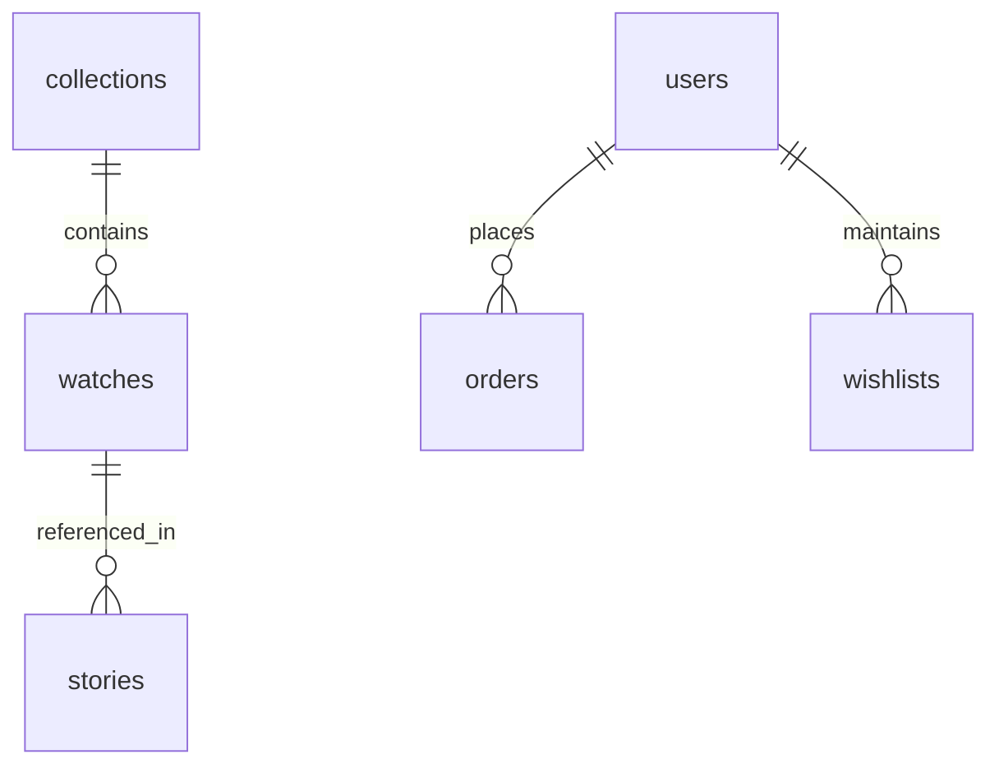

# Firestore Database Schema

This document details the database architecture and collection structures for the Levora platform on Google Cloud Firestore. The schema is designed to support high-resolution static renders, layered transparent dials, and interactive 3D model alignments, with future-proof mappings for multi-collection expansions.

---

## Database Architecture Overview

Firestore follows a flat top-level collection structure to keep queries simple and highly performant. Sub-collections are reserved for user-specific data (e.g., user search history, activity logs) or transactional line items that do not require independent root queries.



---

## 1. `collections` Collection
Stores metadata about the different watch series (e.g., *Heritage Collection*, *Royal Chronographs*).

* **Path**: `/collections/{collectionId}`
* **Fields**:
  * `id` (string, unique): Collection identifier.
  * `name` (string): Human-readable name (e.g. `"Heritage Collection"`).
  * `slug` (string): URL-friendly string (e.g. `"heritage"`).
  * `tagline` (string): Luxury subtitle.
  * `description` (string): Background story and inspiration.
  * `theme` (map): Theme overrides for CSS styling of collection showcases.
    * `primaryColor` (string, hex): Accent gold/silver.
    * `backgroundColor` (string, hex): Ambient background tone.
  * `order` (number): Order in navigation listings.
  * `isActive` (boolean): Flag to toggle visibility.
  * `createdAt` (timestamp): Record creation time.
  * `updatedAt` (timestamp): Record modification time.

---

## 2. `watches` Collection
Stores watch-specific data, including specs, inventory, and dynamic asset metadata. It is built as a **polymorphic schema** to support static renders, layered dials, and 3D models without code alterations. All watch models use temporary internal identifiers (`HERITAGE_01` through `HERITAGE_07`).

* **Path**: `/watches/{watchId}`
* **Fields**:
  * `id` (string, unique): Watch identifier (e.g. `"HERITAGE_01"`).
  * `collectionId` (string): Reference to the parent collection document.
  * `name` (string): Watch model name (dynamically resolved, e.g. `"HERITAGE_01 Model Name"`).
  * `slug` (string): URL-friendly string (e.g. `"heritage-01"`).
  * `price` (number): Price value in minor units (e.g., 28500000 for ₹285,000.00).
  * `currency` (string): ISO 4217 code (e.g., `"INR"`).
  * `stock` (number): Inventory count.
  * `isFeatured` (boolean): Promoted on homepage flag.
  * `checkoutType` (string): `"concierge_inquiry"` or `"direct_checkout"`.
  * `storyIds` (array of strings): References to connected cultural narrative document IDs (e.g. `["story_heritage_01"]`).
  * `specifications` (map): Mechanical and physical attributes.
    * `movement` (string): Calibre specification.
    * `caseDiameter` (string): Diameter size (e.g., `"40mm"`).
    * `waterResistance` (string): Water rating (e.g., `"5 ATM"`).
    * `powerReserve` (string): Hours of reserve.
    * `glass` (string): Sapphire type (e.g., `"Double-domed Sapphire"`).
  * `renderType` (string): `"static"` | `"layered"` | `"3d"`. Used by the front-end to select the appropriate viewer module.
  * `assets` (map): Media configs.
    * `staticUrl` (string): URL for a high-resolution placeholder PNG render (e.g. `"/assets/watches/heritage-01/front.png"`).
    * `galleryUrls` (array of strings): High-res gallery pictures.
    * `layeredDial` (map, optional): Configuration for layered dial animations.
      * `baseDirectory` (string): Storage path prefix.
      * `layers` (array of maps): Ordered list of transparent dial layers from bottom to top.
        * `name` (string): Layer label.
        * `url` (string): Relative asset URL.
        * `zIndex` (number): Render stack ordering.
        * `scrollDepth` (number): Scroll multiplier (parallax intensity).
        * `scaleFactor` (number): Rendering scale default.
    * `model3d` (map, optional): GLTF/GLB metadata.
      * `url` (string): Asset path (local or Firebase Storage).
      * `ambientIntensity` (number): Lighting default.
      * `cameraTarget` (array of numbers): `[x, y, z]` focus coordinate.
      * `cameraPosition` (array of numbers): `[x, y, z]` default camera position.
  * `createdAt` (timestamp)
  * `updatedAt` (timestamp)

---

## 3. `stories` Collection
Stores cultural storytelling, historical narratives, and multimedia details.

* **Path**: `/stories/{storyId}`
* **Fields**:
  * `id` (string, unique): Story identifier (e.g., `"story_heritage_01"`).
  * `title` (string): Title of the narrative (e.g., `"The Story of HERITAGE_01"`).
  * `slug` (string): URL-friendly string (e.g., `"story-heritage-01"`).
  * `summary` (string): Narrative overview.
  * `content` (array of maps): Rich text and media sections configured for GSAP scroll presentation.
    * `type` (string): `"text"` | `"image"` | `"video"` | `"quote"`.
    * `body` (string): Text content or blockquote.
    * `mediaUrl` (string, optional): Image/Video asset URL.
    * `animationTrigger` (string, optional): GSAP animation sequence layout class.
  * `ambientVideoUrl` (string, optional): Lightweight background looping video.
  * `relatedWatchIds` (array of strings): Connects watches referencing this story.
  * `createdAt` (timestamp)
  * `updatedAt` (timestamp)

---

## 4. `users` Collection
Tracks user profiles, dashboard roles, and customer activity.

* **Path**: `/users/{uid}`
* **Fields**:
  * `uid` (string, unique): Firebase Auth User ID.
  * `email` (string): Contact email address.
  * `displayName` (string): User full name.
  * `role` (string): `"customer"` | `"admin"`.
  * `createdAt` (timestamp)
  * `updatedAt` (timestamp)

### `wishlists` Sub-collection
* **Path**: `/users/{uid}/wishlists/{watchId}`
* **Fields**:
  * `watchId` (string): Reference to the watch.
  * `addedAt` (timestamp): Added to wishlist timestamp.

---

## 5. `orders` Collection
Maintains records of luxury inquiries and direct sales.

* **Path**: `/orders/{orderId}`
* **Fields**:
  * `id` (string, unique): Unique order reference.
  * `userId` (string, optional): Logged-in user ID (null for guests).
  * `checkoutType` (string): `"concierge_inquiry"` or `"direct_checkout"`.
  * `contactInfo` (map): Customer contact details.
    * `name` (string)
    * `email` (string)
    * `phone` (string)
  * `shippingAddress` (map, optional)
  * `items` (array of maps): Purchases / Inquiries.
    * `watchId` (string)
    * `priceAtPurchase` (number)
    * `quantity` (number)
  * `status` (string): `"pending_inquiry"` | `"contacted"` | `"awaiting_payment"` | `"processing"` | `"shipped"` | `"cancelled"`.
  * `total` (number): Order amount (minor units).
  * `paymentInfo` (map, optional): Transaction logs for direct checkout.
  * `createdAt` (timestamp)
  * `updatedAt` (timestamp)

---

## Firestore Security Rules Recommendation

```javascript
rules_version = '2';
service cloud.firestore {
  match /databases/{database}/documents {
    
    // User Helper Functions
    function isSignedIn() {
      return request.auth != null;
    }
    function isOwner(userId) {
      return isSignedIn() && request.auth.uid == userId;
    }
    function isAdmin() {
      return isSignedIn() && 
        get(/databases/$(database)/documents/users/$(request.auth.uid)).data.role == 'admin';
    }

    // Collections & Watches (Public read, Admin write)
    match /collections/{collectionId} {
      allow read: if true;
      allow write: if isAdmin();
    }
    match /watches/{watchId} {
      allow read: if true;
      allow write: if isAdmin();
    }

    // Stories (Public read, Admin write)
    match /stories/{storyId} {
      allow read: if true;
      allow write: if isAdmin();
    }

    // User Profile Rules
    match /users/{userId} {
      allow read, update: if isOwner(userId) || isAdmin();
      allow create: if isSignedIn();
      allow delete: if isAdmin();
      
      // Wishlist Sub-collection
      match /wishlists/{watchId} {
        allow read, write: if isOwner(userId);
      }
    }

    // Orders Rules
    match /orders/{orderId} {
      allow create: if true; // Guests can create concierge inquiries
      allow read: if isAdmin() || (isSignedIn() && resource.data.userId == request.auth.uid);
      allow update: if isAdmin();
      allow delete: if false; // Archive orders instead of deleting
    }
  }
}
```
