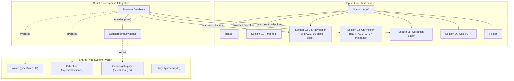

# Levora — Homepage Architecture

This document defines the complete technical architecture for the Levora homepage (`app/page.tsx`).
It covers section composition, component hierarchy, data dependencies, mobile behavior, SEO strategy,
and future GSAP animation integration points.

No React code is included. This is a reference-first architectural blueprint.

---

## 1. Section Map

The homepage is composed of **seven ordered sections**, each serving a distinct narrative purpose
in the luxury storytelling funnel defined in `docs/HOMEPAGE_EXPERIENCE.md`.

```txt
┌─────────────────────────────────────────────────────────────────┐
│  Section 01 — THE THRESHOLD (Hero Stage)                        │
│  Route anchor: #threshold                                        │
│  Viewport height: 100vh (full bleed)                            │
├─────────────────────────────────────────────────────────────────┤
│  Section 02 — THE DIAL REVELATION (Exploded Layers)             │
│  Route anchor: #dial-revelation                                  │
│  Viewport height: 300vh (pinned GSAP scroll)                    │
├─────────────────────────────────────────────────────────────────┤
│  Section 03 — CHRONOLOGY OF DYNASTIES (Story Timeline)          │
│  Route anchor: #chronology                                       │
│  Viewport height: 200vh (horizontal scroll container)           │
├─────────────────────────────────────────────────────────────────┤
│  Section 04 — THE ATELIER (Craftsmanship)                       │
│  Route anchor: #atelier                                          │
│  Viewport height: auto (scroll-triggered reveals)               │
├─────────────────────────────────────────────────────────────────┤
│  Section 05 — THE COLLECTION (Sensory Showcase)                 │
│  Route anchor: #collection                                       │
│  Viewport height: auto (draggable slider)                        │
├─────────────────────────────────────────────────────────────────┤
│  Section 06 — THE PRIVATE SALON (Concierge Conversion)          │
│  Route anchor: #salon                                            │
│  Viewport height: 80vh                                           │
├─────────────────────────────────────────────────────────────────┤
│  Section 07 — FOOTER (Brand Links + Newsletter)                 │
│  Route anchor: (none — persistent layout component)             │
│  Viewport height: auto                                           │
└─────────────────────────────────────────────────────────────────┘
```

---

## 2. Purpose of Each Section

### Section 01 — The Threshold

- **Emotional Goal**: First contact. Silence and restraint before product reveal.
- **Brand Psychology**: Establish that Levora is a cultural institution, not a product grid.
- **Visual Language**: Full-bleed ambient video loop (shadows on sandblasted metal/sapphire).
  Thin serif headline fades in. No visible CTA. Only a centered Levora brand mark.
- **Visitor Action**: Encouraged to scroll via a subtle animated indicator.
- **Copy Anchor**: *"History is not written. It is assembled."*

---

### Section 02 — The Dial Revelation

- **Emotional Goal**: Mechanical awe. The user witnesses the physical depth of a layered art dial.
- **Brand Psychology**: Demonstrates Levora's core USP — the layered dial construction.
- **Visual Language**: A single watch face (`HERITAGE_01 — Chand Baori Dial`) at viewport center.
  Scrolling separates dial layers outward along the Z-axis with floating text labels.
- **Visitor Action**: Passive scrolling drives the reveal — no taps required.
- **Featured Watch**: `HERITAGE_01` (highest architectural complexity for reveal effect).

---

### Section 03 — Chronology of Dynasties

- **Emotional Goal**: Intellectual engagement. The user connects each watch to a historical era.
- **Brand Psychology**: Deepens collector identity — *"I am buying living history."*
- **Visual Language**: Dark stone-textured horizontal timeline. 7 thematic eras linked to
  `HERITAGE_01` through `HERITAGE_07`. Parallax movement + gold connector lines.
- **Visitor Action**: Vertical scroll drives horizontal timeline movement.

---

### Section 04 — The Atelier

- **Emotional Goal**: Establish trust in process and craftsmanship authority.
- **Brand Psychology**: Human hands making extraordinary objects validate price points.
- **Visual Language**: Full-bleed editorial imagery of artisans at work. Scroll-triggered text
  panels reveal specs (movement, sapphire, water resistance).
- **Visitor Action**: Passive scroll reading.

---

### Section 05 — The Collection

- **Emotional Goal**: Transition curiosity into personal desire and object ownership.
- **Brand Psychology**: The gallery presents rarity — only 7 pieces, each unique.
- **Visual Language**: Premium active-card slider. Active card shows macro dial render.
  Adjacent cards are intentionally blurred and scaled down.
- **Visitor Action**: Click and drag to browse. Hover reveals model details.
  CTA per card: *"Explore"* → `/collections/heritage/[slug]`

---

### Section 06 — The Private Salon

- **Emotional Goal**: Reinforce exclusivity. Replace commerce with private consultation.
- **Brand Psychology**: Buyers do not checkout — they are invited.
- **Visual Language**: Minimal dark layout, soft out-of-focus workshop background.
  Single centered copy block. Single CTA button.
- **Visitor Action**: CTA triggers `ConciergeInquiryModal` overlay.
- **Copy Anchor**: *"By Invitation. Request a private showing with a Levora horology specialist."*

---

### Section 07 — Footer

- **Emotional Goal**: Brand permanence and navigational trust.
- **Columns**: Collections / Brand / Services / Corporate (from `lib/constants/navigation.ts`).
- **Newsletter**: Levora Journal subscription via Next.js 16 native `<Form>`.
- **Legal**: Privacy Policy, Terms of Service links.

---

## 3. Component Hierarchy

The following tree maps every section to its composing components. Components are grouped by
origin folder. All values are sourced from `lib/constants/` — no hard-coded strings in markup.

```txt
app/page.tsx                               ← Homepage route (Server Component)
│
├── components/layout/Header.tsx           ← Transparent, scroll-aware floating header
│
├── <section id="threshold">
│   └── components/story/DynamicVideo.tsx  ← Ambient video loop (autoplay, muted, loop)
│       └── [Headline overlay]             ← Typography role: display / serif
│       └── [Scroll indicator]             ← Animated downward arrow (CSS only initially)
│
├── <section id="dial-revelation">
│   └── components/watch/WatchContainer.tsx
│       └── components/watch/LayeredRenderer.tsx  ← GSAP ScrollTrigger scroll-pinned
│           ├── [DialLayer × N]            ← One element per `LayeredDialAsset` depth
│           └── [LayerLabel × N]           ← Side text labels per layer
│
├── <section id="chronology">
│   └── components/story/StoryScroller.tsx ← Horizontal GSAP scroll stage
│       ├── [EraCard × 7]                  ← One per HERITAGE_01–07
│       │   ├── [EraDate]                  ← Cultural era label
│       │   ├── [WatchSilhouette]          ← Blurred watch image hint
│       │   └── [EraDescription]           ← Narrative copy
│       └── [GoldConnectorLines]           ← SVG timeline connectors
│
├── <section id="atelier">
│   └── [EditorialGrid]                    ← CSS grid, full-bleed imagery
│       ├── [AtelierImage × N]             ← Next.js <Image> optimized, AVIF/WebP
│       └── [SpecPanel × N]               ← Scroll-triggered fade-in spec blocks
│
├── <section id="collection">
│   └── components/ui/Slider.tsx           ← Drag-enabled premium card carousel
│       └── components/watch/WatchContainer.tsx × 7
│           └── components/watch/StaticRenderer.tsx
│               └── [WatchMeta overlay]    ← Name, tagline, explore CTA
│
├── <section id="salon">
│   └── components/ui/GlassCard.tsx        ← Container for salon invite block
│       ├── [SalonCopy]                    ← Invitation copy block
│       └── components/ui/Button.tsx       ← "Request Private Consultation"
│           └── components/ui/Modal.tsx    ← ConciergeInquiryModal overlay
│               └── [InquiryForm]          ← Maps to `types/inquiry.ts` InquiryFormData
│
└── components/layout/Footer.tsx           ← Persistent layout footer
    ├── [FooterNavSection × 4]             ← From FOOTER_NAV_SECTIONS constant
    ├── [NewsletterForm]                   ← Next.js <Form> component
    └── [LegalLinks]                       ← Privacy / Terms
```

---

## 4. Data Dependencies

Each section's rendering dependencies are mapped below. All data at launch
is static (from `lib/constants/`). Firebase hydration is planned for Sprint 3.

### Sprint 2 — Static Data Sources

| Section | Data Source | Key Constant / Type |
| :--- | :--- | :--- |
| Header | `lib/constants/navigation.ts` | `HEADER_NAV_LINKS` |
| Threshold | `lib/constants/brand.ts` | `BRAND_IDENTITY.tagline` |
| Dial Revelation | `lib/constants/collection.ts` | `WATCH_PLACEHOLDERS.HERITAGE_01` |
| Chronology | `lib/constants/collection.ts` | `ORDERED_WATCH_PLACEHOLDERS` (all 7) |
| Atelier | `lib/constants/brand.ts` | `BRAND_PHILOSOPHIES` |
| Collection | `lib/constants/collection.ts` | `ORDERED_WATCH_PLACEHOLDERS` (all 7) |
| Salon | `lib/constants/contact.ts` | `CONCIERGE_CONTACT`, `INQUIRY_TYPES` |
| Footer | `lib/constants/navigation.ts` | `FOOTER_NAV_SECTIONS` |

### Sprint 3 — Firebase Live Data (Future)

| Section | Firestore Collection | TypeScript Type |
| :--- | :--- | :--- |
| Dial Revelation | `watches/{HERITAGE_01}` | `Watch` (`types/watch.ts`) |
| Chronology | `watches/*` | `Watch[]` |
| Collection slider | `watches/*`, `collections/{heritage}` | `Watch[]`, `Collection` |
| Concierge form | `inquiries` (write) | `ConciergeInquiry` (`types/inquiry.ts`) |

### Data Flow Diagram



---

## 5. Mobile Behavior

All responsive behavior targets a mobile-first CSS baseline with progressive
enhancement for tablet and desktop. Breakpoints are sourced from `lib/constants/layout.ts`.

| Section | Desktop Behavior | Mobile Behavior (< 768px) |
| :--- | :--- | :--- |
| **Threshold** | Full-screen video, centered headline | Video retained; headline font scaled to `clamp(2.5rem, 8vw, 5rem)` |
| **Dial Revelation** | GSAP pinned scroll, Z-axis layer separation | Pinning disabled. Replaced with tap-to-explode. Layers expand via CSS transitions. Details shown in a bottom drawer |
| **Chronology** | Vertical scroll drives horizontal timeline pan | Converts to vertical stacked cards with simple fade-in. No horizontal scroll |
| **Atelier** | Full-bleed side-by-side editorial grid | Single column stacked layout. Images remain full-width |
| **Collection** | Active-card blur slider with drag | Touch swipe slider. Active card fills 90vw. Blurred adjacent cards hidden |
| **Salon** | Centered glass card with background blur | Full-width card; background blur retained via `backdrop-filter` |
| **Footer** | 4-column grid | Single column stacked accordion |

### Touch Interaction Rules

- All `pointer: fine` hover states must have `pointer: coarse` tap equivalents.
- No scroll-hijacking below `768px` (GSAP pinning disabled via `matchMedia` check).
- `OrbitControls` (3D model viewer) must be bounded to prevent mobile users getting trapped inside the WebGL canvas when scrolling past it.
- Minimum tap target size: `48×48px` on all interactive elements.

---

## 6. SEO Requirements

The homepage must implement the following Next.js 16 metadata API requirements.
All values are derived from `lib/constants/seo.ts`.

### 6.1 Metadata Export (app/page.tsx)

```txt
Export: metadata (static)
├── title:       SEO_DEFAULTS.defaultTitle
├── description: SEO_DEFAULTS.description
├── keywords:    SEO_DEFAULTS.keywords
├── openGraph:   OPEN_GRAPH_DEFAULTS (type: "website")
├── twitter:     TWITTER_DEFAULTS (card: "summary_large_image")
└── robots:      "index, follow"
```

### 6.2 Structured Data (JSON-LD)

- **Type**: `Organization` schema from `getOrganizationJsonLd()` (`lib/constants/seo.ts`)
- **Injection point**: Inside `<head>` via Next.js Script component or `<script type="application/ld+json">`
- **Future**: Add `ItemList` schema for the 7 Heritage Collection watches (Sprint 3, post-Firestore).

### 6.3 Semantic HTML Requirements

| Requirement | Implementation |
| :--- | :--- |
| Single `<h1>` per page | Section 01 Threshold headline only |
| Heading hierarchy | `h1` → Threshold / `h2` → each section title / `h3` → sub-items |
| Landmark regions | `<header>`, `<main>`, `<section>`, `<footer>` semantic elements |
| `<nav>` element | Header navigation wrapped in `<nav aria-label="Primary">` |
| `alt` text | All `<Image>` components must carry descriptive alt text from watch metadata |
| `lang` attribute | `<html lang="en-IN">` set in `app/layout.tsx` |
| Canonical URL | `<link rel="canonical" href="https://levora.in/" />` |

### 6.4 Core Web Vitals Targets

| Metric | Target | Strategy |
| :--- | :--- | :--- |
| LCP | < 2.5s | Hero video served via CDN; fallback `` poster for initial paint |
| CLS | < 0.1 | Fixed dimensions reserved for all watch images and video containers |
| INP | < 200ms | GSAP animations use `transform` / `opacity` only; no layout-triggering properties |
| FID/TBT | Minimal | GSAP and Three.js loaded lazily via `next/dynamic`; no render-blocking scripts |

---

## 7. GSAP Integration Points

GSAP is scoped exclusively to `components/` client wrappers (marked `"use client"`).
Server Components pass static props; GSAP timelines run entirely in the browser.
Refer to `docs/ANIMATION_GUIDE.md` for code patterns and performance rules.

### Integration Map

```txt
Section 02 — Dial Revelation
│   Plugin:      gsap/ScrollTrigger
│   Pattern:     Pin → scrub → layer Z-axis expansion
│   Trigger:     containerRef (LayeredRenderer wrapper div)
│   Start:       "top top"
│   End:         "+=200%"
│   Scrub:       1 (physical friction lag)
│   Pin:         true (disabled on mobile via matchMedia)
│   Data feed:   LayeredDialAsset[].depth → scale, y, opacity
│   Cleanup:     gsap.context() → ctx.revert() on unmount
│   Future hook: lib/gsap/dialReveal.ts (Sprint 2)
│
Section 03 — Chronology of Dynasties
│   Plugin:      gsap/ScrollTrigger + gsap.to (horizontal pan)
│   Pattern:     Vertical scroll → horizontal x-axis translation
│   Trigger:     StoryScroller wrapper div
│   Start:       "top top"
│   End:         "+=150%"
│   Scrub:       1.2
│   Pin:         true (disabled on mobile → vertical stack fallback)
│   Cleanup:     gsap.context() → ctx.revert() on unmount
│   Future hook: lib/gsap/chronologyScroll.ts (Sprint 2)
│
Section 04 — Atelier
│   Plugin:      gsap/ScrollTrigger (reveal only, no pin)
│   Pattern:     Text panels fade-in + slide-up as user scrolls into view
│   Trigger:     Each [data-atelier-panel] element
│   Start:       "top 80%"
│   End:         "top 30%"
│   Scrub:       false (one-shot trigger, not scrubbed)
│   Cleanup:     gsap.context() → ctx.revert() on unmount
│   Future hook: lib/gsap/atelierReveal.ts (Sprint 2)
│
Section 01 — Threshold (Header fade)
│   Plugin:      gsap (no ScrollTrigger)
│   Pattern:     Headline opacity + letter-spacing entrance on page load
│   Trigger:     DOMContentLoaded / useEffect on mount
│   Duration:    2.4s, ease: "power2.out"
│   Stagger:     0.08s per character (SplitText if licensed, else word-level)
│   Cleanup:     gsap.context() → ctx.revert() on unmount
│   Future hook: lib/gsap/thresholdEntrance.ts (Sprint 2)
│
Header — Scroll-Aware Hide / Reveal
    Plugin:      gsap/ScrollTrigger
    Pattern:     Header translateY(-100%) on scroll down, restore on scroll up
    Direction:   Scroll velocity direction detection (ScrollTrigger onUpdate)
    Scrub:       false (velocity-based, not position-based)
    Future hook: lib/gsap/headerScroll.ts (Sprint 2)
```

### GSAP Module Placeholder Structure (lib/gsap/)

```txt
lib/gsap/
├── thresholdEntrance.ts   ← Hero headline entrance animation factory
├── dialReveal.ts          ← LayeredRenderer ScrollTrigger timeline factory
├── chronologyScroll.ts    ← StoryScroller horizontal pan factory
├── atelierReveal.ts       ← Atelier panel stagger reveal factory
└── headerScroll.ts        ← Header hide/show on scroll velocity
```

> All factory functions accept a `containerRef` and return a GSAP `Context` object
> for lifecycle-safe cleanup in React. No timelines are created at module level.

---

## 8. Dependency Matrix Summary

| Component | Depends On (Constants) | Depends On (Types) | GSAP | Firebase |
| :--- | :--- | :--- | :--- | :--- |
| `Header` | `navigation.ts` | — | `headerScroll.ts` | — |
| `DynamicVideo` | `brand.ts` | `MediaAsset` | — | — |
| `LayeredRenderer` | `collection.ts` | `Watch`, `LayeredDialAsset` | `dialReveal.ts` | Sprint 3 |
| `StoryScroller` | `collection.ts` | `Watch`, `Story` | `chronologyScroll.ts` | Sprint 3 |
| `WatchContainer` | `collection.ts` | `Watch` | — | Sprint 3 |
| `StaticRenderer` | `collection.ts` | `Watch`, `MediaAsset` | — | Sprint 3 |
| `Slider` | `collection.ts` | `Watch[]` | — | Sprint 3 |
| `Button` | — | — | — | — |
| `GlassCard` | — | — | — | — |
| `Modal` | `contact.ts` | `ConciergeInquiry` | — | Sprint 3 |
| `Footer` | `navigation.ts`, `brand.ts` | — | — | — |

---

## 9. File Ownership Map

| File | Role | Sprint |
| :--- | :--- | :--- |
| `app/page.tsx` | Homepage route — Server Component shell | Sprint 2 |
| `app/page.module.css` | Homepage-scoped layout styles (if needed) | Sprint 2 |
| `components/layout/Header.tsx` | Global scroll-aware header | Sprint 2 |
| `components/layout/Footer.tsx` | Global footer | Sprint 2 |
| `components/story/DynamicVideo.tsx` | Hero ambient video loop | Sprint 2 |
| `components/story/StoryScroller.tsx` | Chronology horizontal GSAP scroller | Sprint 2 |
| `components/watch/WatchContainer.tsx` | Polymorphic renderer selector | Sprint 2 |
| `components/watch/LayeredRenderer.tsx` | GSAP dial explosion renderer | Sprint 2 |
| `components/watch/StaticRenderer.tsx` | Static dial image card | Sprint 2 |
| `components/ui/Slider.tsx` | Collection drag slider | Sprint 2 |
| `components/ui/GlassCard.tsx` | Glass container primitive | Sprint 2 |
| `components/ui/Button.tsx` | Luxury button primitive | Sprint 2 |
| `components/ui/Modal.tsx` | Overlay modal frame | Sprint 2 |
| `lib/gsap/dialReveal.ts` | GSAP dial factory | Sprint 2 |
| `lib/gsap/chronologyScroll.ts` | GSAP scroller factory | Sprint 2 |
| `lib/gsap/atelierReveal.ts` | GSAP panel reveal factory | Sprint 2 |
| `lib/gsap/thresholdEntrance.ts` | GSAP hero entrance factory | Sprint 2 |
| `lib/gsap/headerScroll.ts` | GSAP header velocity hook | Sprint 2 |

---

*Document status: Sprint 2 Reference — Pre-implementation blueprint.*
*Last updated: Sprint 1 completion.*
*Cross-references: `docs/HOMEPAGE_EXPERIENCE.md`, `docs/ANIMATION_GUIDE.md`,*
*`docs/COMPONENTS.md`, `lib/constants/`, `types/`.*
