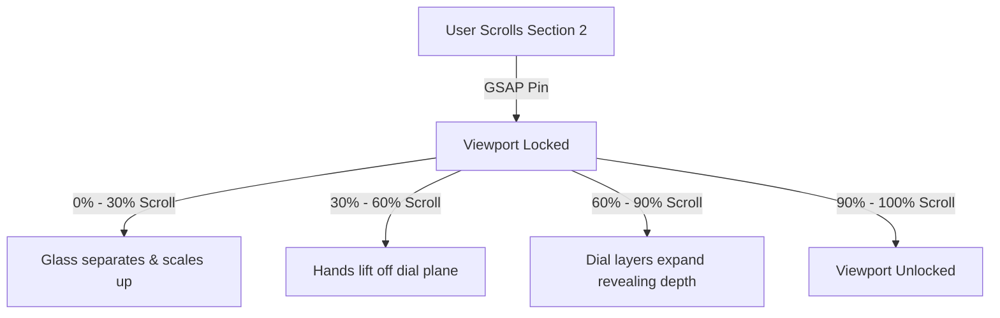

# Homepage Experience & Storytelling Blueprint

This document defines the complete user experience, visitor psychology journey, scroll storytelling flow, and interactive animation concepts for the Levora homepage. The goal is to build a world-class luxury watch entrance that feels uniquely Indian through light, geometry, and material heritage, avoiding typical visual clichés.

---

## 1. Visual Language & Tone

The homepage design adopts a **"Shadow and Gold"** theme. 
* **Avoid Stereotypes**: No loud traditional patterns, bright saffron fills, or cliché symbols. Instead, draw inspiration from:
  * **Indian Architecture & Geometry**: The repeating symmetrical lines of stepwells (Adalaj/Chand Baori), the celestial alignments of Jantar Mantar, and the clean stone lattices of historic forts.
  * **Light & Atmosphere**: The soft bronze of twilight, the deep charcoal shadows of stone walls, and the reflective gleam of gold and sterling silver.
  * **Materiality**: Contrast rough-hewn stone textures with micro-polished metal surfaces in the user interface.

---

## 2. Visitor Psychology Journey

```txt
[ 1. Hero: Curiosity ] ➔ [ 2. Dial Layering: Awe ] ➔ [ 3. Storytelling: Intellect ] ➔ [ 4. Gallery: Desire ] ➔ [ 5. Salon: Exclusivity ]
```

1. **Curiosity (Hero)**: A quiet, cinematic introduction. The user is introduced to a mood, not a product grid.
2. **Awe (Exploded Dial)**: An interactive mechanical revelation. The user understands the physical depth and craftsmanship of the dial construction.
3. **Intellectual Connection (Historical Narrative)**: The watch becomes a cultural storytelling medium. The user connects with the historical inspirations behind the model.
4. **Desire (Collection Gallery)**: The user views the collection as rare collectors' items, transitioning from artistic interest to a personal desire to possess the object.
5. **Exclusivity & Action (The Private Salon)**: The user requests entry into a private consultation, concluding the journey with conversion.

---

## 3. Homepage Structure & Scroll Flow (Top to Bottom)

### Section 1: The Threshold (Hero Stage)
* **Emotional Objective**: Establish silence, luxury, and anticipation.
* **Visuals**: A full-screen ambient video loop of shadows moving slowly across sandblasted metal and sapphire glass. A thin, minimal serif headline fades in: *"History is not written. It is assembled."*
* **UX/Interaction**: A subtle indicator encourages scrolling. The header is fully transparent; only a gold brand mark is visible.

### Section 2: The exploded Dial (GSAP Layer Separation)
* **Emotional Objective**: Create mechanical awe and showcase the "layered dial" USP.
* **Visuals**: The page locks (pins) in place. A single watch case (`HERITAGE_01`) sits in the center. As the user scrolls, the watch case opens, and the dial components (sapphire glass, hands, custom gold marker layers, art canvas base) separate along the Z-axis, floating toward the viewer.
* **Scroll Storytelling**: Dynamic text indicators fade in on the side, highlighting what each layer represents (e.g., *"Layer 01: The Hand-Patinated Canvas"*, *"Layer 02: Laser-Cut Silver Filigree"*).
* **GSAP Animation Concept**:
  * Pin the section for `200vh` of scroll distance.
  * Scale and push absolute elements outward, mapping scroll progress to CSS scale, translation, and opacity values.



### Section 3: Chronology of Dynasties (The Story Timeline)
* **Emotional Objective**: Establish heritage and narrative depth.
* **Visuals**: Horizontal scroll stage. A heavy, dark stone-textured background. As the user scrolls vertically, the timeline moves horizontally, showing 7 thematic cultural eras linked to `HERITAGE_01` through `HERITAGE_07`.
* **UX/Interaction**: Parallax background movement. Subtle gold lines connect the historical dates to the corresponding watch silhouettes.

### Section 4: The Atelier (Craftsmanship Showcase)
* **Emotional Objective**: Build trust in craftsmanship and quality.
* **Visuals**: Large, full-bleed imagery showing close-up shots of hands applying gold leaf, laser cutters carving brass filigree, and watches being assembled.
* **UX/Interaction**: Scroll-triggered text blocks fade in alongside the images, detailing the technical specs (movement, double-domed sapphire, water resistance).

### Section 5: The Collection (Sensory Showcase)
* **Emotional Objective**: Transition curiosity into personal desire.
* **Visuals**: A premium slider showing the 7 models. The active card displays a detailed macro render, while background cards remain blurred.
* **UX/Interaction**: Smooth click-and-drag interactions. Hovering over a card reveals the watch model details (case diameter, material highlights) and a link to enter the product detail layout page.

### Section 6: The Private Salon (Concierge Conversion)
* **Emotional Objective**: Reinforce exclusivity and prompt high-intent inquiries.
* **Visuals**: A minimal dark layout showing a soft, out-of-focus background of a private workshop. The text reads: *"By Invitation. Request a private showing with a Levora horology specialist."*
* **UX/Interaction**: An elegant "Request Private Consultation" button triggers the `ConciergeInquiryModal` overlay.

---

## 4. GSAP Animation Design Standards

To ensure animations feel premium and load cleanly:
1. **The Scrub Friction Principle**:
   * Set scroll scrub values between `1` and `1.5` seconds. This introduces physical lag, making scroll animations feel smooth even if the visitor scrolls erratically.
2. **Dynamic Viewport Anchors**:
   * All ScrollTrigger bounds must use relative viewport landmarks (`trigger: "section", start: "top top", end: "bottom bottom"`), ensuring animations scale correctly across display sizes without recalculating values.
3. **Timeline Cleanup**:
   * All animations must register inside scope cleanups, ensuring animations reset completely when the user navigates between routes.

---

## 5. Mobile Experience Considerations

Complex scroll interactions can feel clunky on mobile devices due to touch input lag. We apply the following mobile fallback strategies:

* **No Viewport Pinning**: On devices below `768px`, disable GSAP section pinning for the exploded dial to prevent scroll hijacking.
* **Tap-to-Explode Fallback**: Replace scroll-driven separation with a simple tap interaction. When the user taps the watch face on mobile, the layers expand using CSS transitions, and details display in a bottom drawer.
* **Horizontal Swipe**: Horizontal timeline scroll stages convert into clean vertical scrolling stacks with simple fade-in actions.
* **Touch Optimization**: Restrict three-dimensional OrbitControls boundaries to prevent mobile users from getting stuck while attempting to scroll past WebGL canvas elements.
