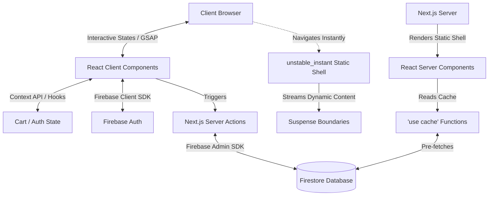

# Levora Project Analysis & Architectural Recommendations

This document provides a detailed analysis of the Levora codebase structure, identifies missing structural directories, proposes a production-grade architecture built around Next.js 16, React 19, Tailwind CSS v4, and Firebase, and suggests critical documentation files to create before active development begins.

---

## 1. Analysis of Current Project Structure

The project currently contains a clean, minimal Next.js 16 boilerplate utilizing React 19 and Tailwind CSS v4. Below is the breakdown of the existing workspace structure:

### Root Configuration Files
* **`package.json`**: Configures Next.js `16.2.7`, React `19.2.4`, and Tailwind CSS `v4` (`@tailwindcss/postcss` and `tailwindcss` as dependencies).
* **`next.config.ts`**: Currently empty (`{}`).
* **`tsconfig.json` & `eslint.config.mjs`**: Standard TypeScript and modern ESLint flat configurations.
* **`postcss.config.mjs`**: Sets up Tailwind v4 compiling.
* **`AGENTS.md` & `CLAUDE.md`**: Custom instructions directing AI assistants to the version-matched documentation inside `node_modules/next/dist/docs/`.
* **`PROJECT_ARCHITECTURE.md`**: Outlines the high-level brand positioning (Indian heritage-inspired dials, gold/silver elements, luxury horology), product strategy (Heritage Collection consisting of 7 flagship watches), and basic technology stack.

### Directories
* **`app/`**: Standard App Router root folder containing:
  * `globals.css`: Imports Tailwind v4 (`@import "tailwindcss";`) and establishes basic CSS custom properties for color variables (light/dark mode themes).
  * `layout.tsx`: Configures standard typography (`Geist` & `Geist Mono` Google fonts) and initializes the root html structure.
  * `page.tsx`: Default Next.js boilerplate landing page.
  * `favicon.ico`: Default boilerplate icon.
* **`public/`**: Contains default Next.js starter assets (`next.svg`, `vercel.svg`, etc.).
* **`node_modules/` & `.next/`**: System-generated folders for package dependencies and build outputs.

---

## 2. Identified Missing Folders

To transition this boilerplate into a production-grade, immersive luxury watch portal with storytelling, customizer utilities, and Firebase-driven e-commerce capabilities, the following folder structure is missing and should be introduced under the root (since the current project uses a root-level `app/` structure rather than a `src/` directory):

```txt
├── components/                  # Reusable UI & Layout Components
│   ├── ui/                      # Base primitives (glassmorphic cards, luxury buttons, modals)
│   ├── layout/                  # Global components (Navbar, Footer, Search Overlay)
│   ├── watch/                   # Watch-specific components (layer showcases, customizer)
│   └── story/                   # Multimedia storytelling components (GSAP scroll containers)
├── lib/                         # Core Utilities & Integration Files
│   ├── firebase/                # Firebase configuration & operations
│   │   ├── client.ts            # Client-side Firebase Init (Auth, Analytics)
│   │   └── admin.ts             # Server-side Admin SDK (Server Actions, secure Firestore writes)
│   ├── constants/               # Static dataset declarations (watch collections, specifications)
│   └── utils/                   # Shared utility functions (styling merges, currency formatters)
├── hooks/                       # Custom React hooks (useAuth, useCart, useGSAPScroll)
├── context/                     # Shared React contexts (CartContext, CustomizerStateContext)
├── public/                      # Static Assets
│   └── assets/                  # Brand-specific static files
│       ├── brand/               # Logos, typography files, iconography
│       ├── watches/             # High-resolution watch renders and dial vector layers
│       ├── stories/             # Images and background visuals for cultural storytelling
│       └── videos/              # Video loops for ambient header background and detail panels
```

---

## 3. Recommended Production-Grade Architecture

To ensure the website represents a premium luxury watchmaker, we must prioritize **visual excellence, micro-animations, fast load performance, and secure, lightweight database integrations.**



### A. Next.js 16 Best Practices & Performance
Because Next.js 16 is installed, we should leverage its advanced APIs to optimize the page load experience:

1. **Instant Navigations (`unstable_instant`)**:
   * For watch detail routes (`app/watch/[slug]/page.tsx`) and collection routes, we must export:
     ```typescript
     export const unstable_instant = { prefetch: 'static' };
     ```
   * This forces Next.js to compile and serve a static layout shell instantly upon client-side navigation, preventing page transitions from locking up while waiting for database queries to complete.
2. **Suspense boundaries**:
   * Dynamic parameters must be handled as promises: `const { slug } = await params`.
   * Keep dynamic inventory, stock check, or user-specific price estimates isolated behind React `<Suspense>` boundaries. They will stream in in the background while the cached details load instantly.
3. **Optimized Caching (`'use cache'`)**:
   * Place the `'use cache'` directive in functions fetching watch properties (such as the 7 flagship watches in the Heritage Collection) and cultural stories, as this data changes infrequently.
   * Enable `cacheComponents: true` in `next.config.ts`.
4. **`<Form>` Component**:
   * Use the native Next.js `<Form>` component for newsletter sign-ups, wishlist searching, and admin dashboard filters, ensuring built-in prefetching and zero-JavaScript fallbacks.

### B. Visual & Animation Architecture
Luxury watch portals require smooth, premium visual feedback that standard e-commerce templates lack:
1. **GSAP (GreenSock Animation Platform)**:
   * **Visual USP**: The brand features "laser-cut layered dial construction." GSAP combined with `ScrollTrigger` is perfect for building a scroll-driven exploded-view watch simulator. As the user scrolls, the watch layers (glass, hands, silver elements, gold markers, heritage art dial) separate along the Z-axis.
2. **Framer Motion**:
   * Use for micro-animations (e.g., hover effects on buttons, glassmorphic dropdown expansions, and modal overlays).
   * Utilize `AnimatePresence` and Shared Layout Transitions (e.g., watch items flying into the shopping cart).
3. **Tailwind CSS v4 Custom Luxury Palette**:
   * Update the `@theme` rule in `globals.css` to represent a high-end luxury watch design:
     * Dark Neutral Backgrounds: Deep rich charcoals and gunmetal slate (e.g., `--color-slate-950`).
     * Accents: Metallic gold (`#D4AF37`), soft champagne, and reflective silver tones.
     * Glassmorphic surfaces: High-blur, low-opacity borders creating floating dial effect.

### C. Database & Backend Architecture (Firebase & Firestore)
Keep client bundles light by splitting Firebase operations between client and server:

1. **Firebase Client SDK (`lib/firebase/client.ts`)**:
   * Restrict to auth state monitoring (`onAuthStateChanged`) and real-time subscription bindings where necessary.
2. **Firebase Admin SDK & Server Actions (`lib/firebase/admin.ts`)**:
   * Use Server Actions for administrative updates, order processing, and shopping cart checkouts. This keeps the large Admin SDK and secure credentials off the browser entirely.
3. **Proposed Firestore Data Schema**:
   * **`watches` Collection**:
     ```json
     {
       "id": "watch_001",
       "name": "The Maurya Chronograph",
       "slug": "maurya-chronograph",
       "collection": "heritage",
       "description": "Inspired by the architectural geometry of ancient Indian dynasties.",
       "price": 285000,
       "currency": "INR",
       "materials": ["18k Gold Plate", "925 Sterling Silver Layer", "Sapphire Glass"],
       "layers": [
         {"name": "Bezel", "image": "/assets/watches/maurya/layer-bezel.png", "zIndex": 4},
         {"name": "Hands", "image": "/assets/watches/maurya/layer-hands.png", "zIndex": 3},
         {"name": "Gold Markers", "image": "/assets/watches/maurya/layer-markers.png", "zIndex": 2},
         {"name": "Heritage Dial Canvas", "image": "/assets/watches/maurya/layer-dial.png", "zIndex": 1}
       ],
       "stock": 15,
       "specifications": {
         "movement": "Automatic Calibre L98",
         "caseDiameter": "40mm",
         "waterResistance": "5 ATM"
       },
       "images": ["/assets/watches/maurya/front.png", "/assets/watches/maurya/angle.png"]
     }
     ```
   * **`stories` Collection**:
     ```json
     {
       "id": "story_001",
       "title": "Crafting the Maurya: Dial Storytelling",
       "slug": "crafting-maurya",
       "content": "Deep dive text describing the historical details...",
       "mediaUrl": "/assets/videos/maurya-craftsmanship.mp4",
       "relatedWatches": ["watch_001"]
     }
     ```

---

## 4. Recommended Documentation Files Needed Before Development

To streamline collaborative development and establish clear guardrails for UI and data modeling, the following documentation files should be created:

### 1. `docs/COMPONENTS.md`
* **Purpose**: Defines the design system token parameters (borders, blur levels, spacing) to guarantee a visual finish matching a top-tier luxury watch portal.
* **Key Content**: Specifications for glassmorphism utility classes, color hex values (gold, silver, dark neutral), premium typography hierarchy (Garamond-style serif headings paired with clean geometric sans-serif body text), and interactive hover state rules.

### 2. `docs/DATABASE_SCHEMA.md`
* **Purpose**: Outlines the exact structures of Firestore collections, sub-collections, indexes, and Firestore security rules.
* **Key Content**: Field typing definitions, collection relationships, sample documents, dynamic index definitions, and write validation rules (e.g., preventing orders without valid pricing).

### 3. `docs/ANIMATION_GUIDE.md`
* **Purpose**: Establishes performance rules and triggers for complex GSAP and Framer Motion sequences.
* **Key Content**: Instructions on how to build the scroll-linked dial layer explosion, guidelines for managing animation frames without causing layout shifts, performance optimization rules (like using CSS transforms, `will-change`, and proper timeline cleanup in React hooks).

### 4. `docs/FIREBASE_SETUP.md`
* **Purpose**: Details environment setup instructions for team members to hook their local dev environment into test Firebase projects.
* **Key Content**: Firebase Console initialization guidelines, service account generation guidelines for Local Admin usage, required environment variables (`NEXT_PUBLIC_FIREBASE_API_KEY`, etc.), and Firestore Emulator configuration instructions.

### 5. `docs/NEXTJS_CONVENTIONS.md`
* **Purpose**: Clarifies how Next.js 16 App Router paradigms should be written across routes to enforce fast load times and clean builds.
* **Key Content**: Code snippets demonstrating React 19 async parameter resolution, `'use cache'` execution patterns, Suspense wrapper standards, and `unstable_instant` page layouts.
